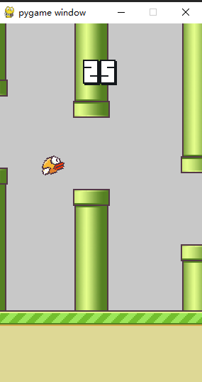
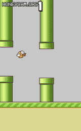
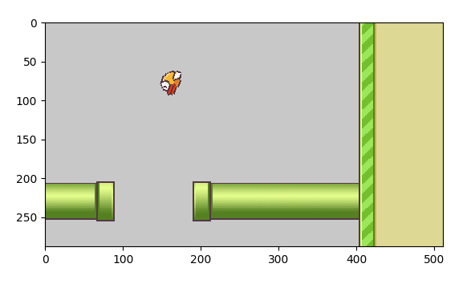
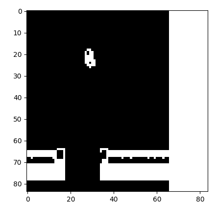
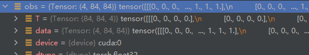
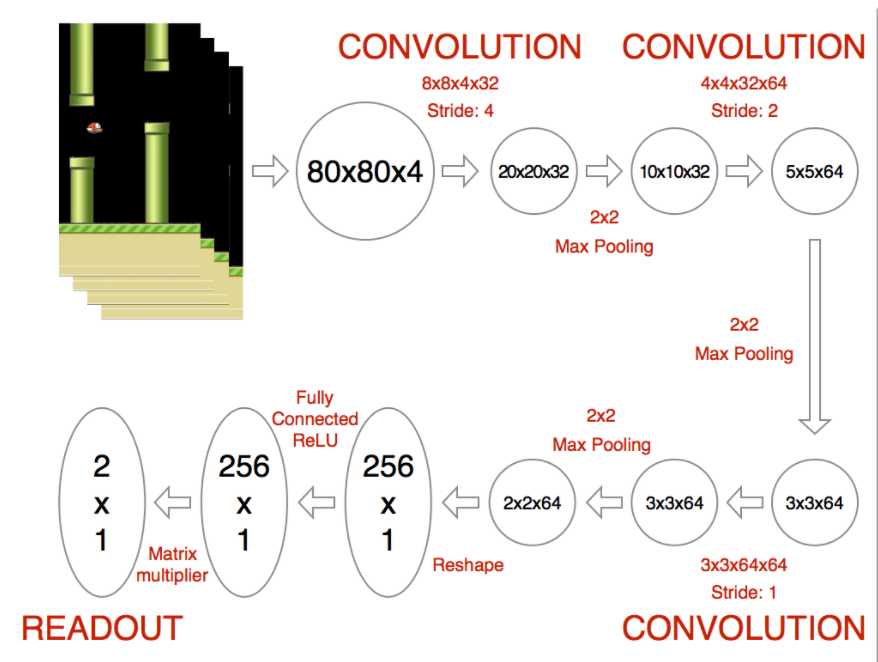
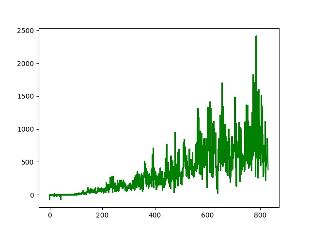

# 1 环境：Flappybird

env from github: https://github.com/Talendar/flappy-bird-gym





该环境在open gym下，适用于强化学习的接口。

具体地，环境原生奖励：每步step始终返回奖励为1，终止也为1

# 2 算法——DQN

### 2.1 第一步：预处理

针对图像进行预处理，主要包括 剪裁大小-> 转换为灰度图->图像二值化

```python
import cv2
def process_img(image):
    image= cv2.resize(image, (84, 84)) #重置大小
    image= cv2.cvtColor(image, cv2.COLOR_BGR2GRAY) #颜色转换
    image=cv2.threshold(image, 199, 1, cv2.THRESH_BINARY_INV) #二值化
    return image[1]
```

主要用到cv2 这个库，可以看到阈值设定地是199，>199时的图像值为1。变化如下：



最终转换为：




为了能够表现小鸟的运动，如DQN所写的一样，我们将连续四帧(step)的数据合并扔到网络中进行动作预测



最终得到的obs shape为(4,84,84) 值为0 1。

### 2 DQN

#### 2.1 DQN的网络结构

参考：[yenchenlin/DeepLearningFlappyBird: Flappy Bird hack using Deep Reinforcement Learning (Deep Q-learning). (github.com)](https://github.com/yenchenlin/DeepLearningFlappyBird)



这个网络结构是在DQN的基础上加了padding和池化层，我们也参考这个网络结构来搭建

```python
import torch
import torch.nn as nn
class Q_net(nn.Module):
    def __init__(self, Dim_in, act_dim):
        super().__init__()
        self.conv1 = nn.Conv2d(in_channels=Dim_in,out_channels=32,kernel_size=(8,8),stride=(4,4)) #(84-8)/4 +1 =76/4 +1 =20
        self.maxpool1 =nn.MaxPool2d(2,stride=2)
        self.conv2 = nn.Conv2d(in_channels=32, out_channels=64, kernel_size=(4,4), stride=(2,2)) # (20-4)/2 +1 =9
        self.maxpool2 = nn.MaxPool2d(2, stride=2,padding=1)
        self.conv3 = nn.Conv2d(in_channels=64, out_channels=64, kernel_size=(3,3), stride=(1,1)) # (9-3)/1 +1 =7  7*7*64
        self.fc1   = nn.Linear(in_features=256,out_features=256)
        self.fc2   = nn.Linear(in_features=256,out_features=act_dim)
        self.Relu =nn.ReLU()
    def forward(self,x): # inshape (batch,x,y,channel)
        x=  self.Relu(self.conv1(x))
        x = self.Relu(self.conv2(x))
        x = self.maxpool1(x)
        x = self.Relu(self.conv3(x))
        x = self.maxpool2(x)
        x = x.view(x.size(0),-1)
        x = self.Relu(self.fc1(x))
        x = self.fc2(x)
        return x
```

#### 2.2 Replay Buffer

DQN的一大改进就是使用了Replay Buffer来进行存储样本，采样更新。Buffer的主要功能是存储和更新,我们的Replay Buffer实现如下：

```python
import numpy as np
class Replay_Buffer():
    def __init__(self,arg):
        self.capacity=arg.capacity
        self.action_dim=arg.action_dim
        self.env_obs_space = arg.obs_dim
        self.data={
            'action':np.zeros((self.capacity,1)),
            'obs':np.zeros((self.capacity,self.env_obs_space[0],self.env_obs_space[1],self.env_obs_space[2])),
            'next_obs': np.zeros((self.capacity,self.env_obs_space[0],self.env_obs_space[1],self.env_obs_space[2])),
            'done':np.zeros((self.capacity,1)),
            'reward':np.zeros((self.capacity,1)),
        }
        self.ptr = 0
        self.isfull = 0
    def store_data(self, transition,length):
        if self.ptr+length>self.capacity: #超过容量的情况
            rest = self.capacity-self.ptr
            for key in self.data:
                store_tmp = np.array(transition[key][:],dtype=object)
                store_tmp=np.expand_dims(store_tmp,-1) if len(store_tmp.shape)== 1 else store_tmp
                self.data[key][self.ptr:]=store_tmp[:rest] #judge_edge
                transition[key]=transition[key][rest:]
            self.ptr=0
            length-=rest
            self.isfull=1
        for key in self.data:
            store_tmp = np.array(transition[key][:],dtype=object)
            self.data[key][self.ptr:self.ptr+length]= np.expand_dims(store_tmp,-1) if len(store_tmp.shape)== 1 else store_tmp #judge_edge
        self.ptr += length
    def sample(self,batch): 
        if self.isfull:
            batch_index = np.random.choice(self.capacity,size=batch) #使用np.random.choice进行随机采样
        else:
            batch_index = np.random.choice(self.ptr,size=batch)
        return {key:self.data[key][batch_index,:] for key in self.data}
```

#### 2.3 DQN agent主体

主体部分主要包括 选取动作 和 更新两部分。

首先说动作部分，因为需要探索，所以需要选择有epsilon的概率来决定是否使用贪婪动作，

这里尤其要注意，对于这个环境，0.1的随机概率选取动作太大了！小鸟很容易就飞上天，所以参考别人的方法，选择了一个衰减的epsilon

另外，更新部分使用了一个target网络，它是每满X步才会和DQN的预测网络同步一次，以保证更新稳定。

具体地，更新公式为：
$$
\theta=\theta+\alpha[r+\gamma max_{a'}Q(s',a';\theta^-)-Q(s,a;\theta)]\nabla Q(s,a;\theta)

$$
也就是一个以TD target为目标的 MSE的更新形式

```python
import random
import sys
import numpy as np
import torch
sys.path.append('algorithm/')
from QNet import Q_net
from Replay_Buffer import Replay_Buffer
import torch.nn as nn
class DQN():
    def __init__(self,env,arg):
        self.arg = arg
        self.Buffer=Replay_Buffer(arg)
        self.Net = Q_net(arg.Frames,arg.action_dim).to(self.arg.cuda)
        self.targetNet= Q_net(arg.Frames,arg.action_dim).to(self.arg.cuda)
        self.learnstep=0
        self.optimizer = torch.optim.Adam(self.Net.parameters(), lr=arg.learning_rate)
        self.loss_func = nn.MSELoss()
        
    def get_action(self,obs):
        if random.random()>self.arg.epsilon:
            return self.greedy_action(obs)
        else:
            return random.randint(0,1)

    def greedy_action(self,obs):
        obs = torch.tensor(obs, device=self.arg.cuda, dtype=torch.float32)
        if len(obs.shape) == 3:
            obs = obs.unsqueeze(0)
        obs = self.Net(obs)
        action = np.argmax(obs.detach().cpu().numpy(), axis=-1)
        return action
    
    def update(self,data):
        action,obs,next_obs,done,reward = data['action'],data['obs'],data['next_obs'],data['done'],data['reward']
        if self.learnstep % self.arg.Q_NETWORK_ITERATION==0:
            self.targetNet.load_state_dict(self.Net.state_dict())
        self.learnstep+=1
        obs = torch.tensor(obs, device=self.arg.cuda, dtype=torch.float32)
        next_obs = torch.tensor(next_obs, device=self.arg.cuda, dtype=torch.float32)
        action = torch.tensor(action, device=self.arg.cuda, dtype=torch.long)
        reward = torch.tensor(reward, device=self.arg.cuda, dtype=torch.float32)
        q_eval = self.Net(obs).gather(1, action)
        q_next = self.targetNet(next_obs).detach()
        q_target = reward + self.arg.gamma * q_next.max(1)[0].view(action.shape[0], 1)
        loss = self.loss_func(q_eval, q_target)
        self.optimizer.zero_grad()
        loss.backward()
        self.optimizer.step()
```

#### 2.4 主体部分

这里需要说明的是，我在终止阶段减去了一个101的奖励值，这是因为当agent持续输出1时，小鸟就直接飞到天上了。。这样直到撞到管子时，能够得到101的奖励，因此为了平衡这一点，我在该幕结束的时候，让奖励减去了101 (不过这并不好，因为我发现当训练到一定程度时便收敛了，可能是因为这时候的101奖励是在最后的，而一幕奖励是有折扣的，所以最好训练到一定程度时去掉这个惩罚，或者也根据已获得的奖励来设置惩罚。)

```python
import math
import random
import time
import flappy_bird_gym
import cv2
import torch
from utils.utils import process_img
import numpy as np
from algorithm.DQN_agent import DQN
from arguments import arguments
import matplotlib.pyplot as plt
env = flappy_bird_gym.make("FlappyBird-rgb-v0")
arg = arguments()
agent=DQN(env,arg)

def test_performance(): # 测试
    reward_list = []
    for i in range(arg.test_episodes):
        obs = process_img(env.reset())
        obs = np.expand_dims(obs, axis=0)
        obs = np.repeat(obs, 4, axis=0)
        done = False
        reward = 0
        while not done:
            action = agent.greedy_action(obs)
            transition = env.step(action)
            next_obs = np.expand_dims(process_img(transition[0]),axis=0)
            obs = np.concatenate((next_obs,obs[:3,:,:]),axis=0)
            reward += transition[1]
            done = transition[2]
        reward_list.append(reward)
    return (sum(reward_list)/arg.test_episodes)-101

def load_state():
    modelpath = 'model/model4200.pkl'
    state_file = torch.load(modelpath)
    agent.Net.load_state_dict(state_file)
    agent.targetNet.load_state_dict(state_file)
def training():
    reward_graph_data=[]
    #plt.ion()
    fig, ax = plt.subplots()
    for i in range(arg.episodes):
        obs = process_img(env.reset())
        obs = np.expand_dims(obs, axis=0)
        obs = np.repeat(obs, 4, axis=0)
        done = False
        transition_store = {
            'obs': [],
            'next_obs': [],
            'action': [],
            'reward': [],
            'done': []
        }
        if i%10000==0 and i>100:  #每10000步设置epsilon衰减
            arg.epsilon/=math.sqrt(10)
        while not done:
            action = agent.get_action(obs)
            if i < 300:
                action = random.randint(0,1)
            transition = env.step(action)
            next_obs = np.expand_dims(process_img(transition[0]),axis=0)
            next_obs = np.concatenate((next_obs,obs[:3,:,:]),axis=0)
            reward = transition[1]
            done = transition[2]
            if done:
                reward -= 101 #惩罚
            #next_obs = np.stack(next_obs, axis=0)
            # plt.imshow(obs[0], cmap="gray",interpolation='nearest')
            # plt.show()
            transition_store['obs'].append(obs)
            transition_store['next_obs'].append(next_obs)
            transition_store['reward'].append(reward)
            transition_store['done'].append(done)
            transition_store['action'].append(action)
            obs = next_obs
        if sum(transition_store['reward'])>0: # 探索到奖励
            print('breakthourgh!'+str(sum(transition_store['reward'])))
        agent.Buffer.store_data(transition_store, len(transition_store['obs']))
        if agent.Buffer.ptr > 500:  # 保证前期存有一定的样本
            agent.update(agent.Buffer.sample(arg.updatebatch))
        if i % 50 == 0: #每训练50episode 测试一次模型
            if i% 300 ==0: #每训练300episode 保存一次模型
                torch.save(agent.Net.state_dict(),'model/model'+str(i)+'.pkl')
            average_r = test_performance()
            print('iteration episodes: '+str(i)+' test average reward: '+str(average_r))
            reward_graph_data.append(average_r)
            ax.plot(reward_graph_data, 'g-', label='reward')
            plt.savefig('graph.jpg')
            #plt.clf()

if __name__ == '__main__':
    load_state()
    training()
```

#### 2.5 参数部分

我将参数写在了一个类中

```python
class arguments():
    def __init__(self):
        self.gamma = 0.99
        self.action_dim = 2
        self.obs_dim = (4,84,84) #80*80*3
        self.capacity = 50000
        self.cuda = 'cuda:0'
        self.Frames = 4
        self.episodes = int(1e8)
        self.updatebatch= 512
        self.test_episodes= 10
        self.epsilon = 0.1
        self.Q_NETWORK_ITERATION = 50
        self.learning_rate = 0.001
```

当然，更常见的情况应该是使用 argparse库

# 3 训练结果



 从训练结果可以看到，效果还可以接受，最高大概可以过50个管子左右。效果还需要进一步调整。

不过DQN的效果是达到了。

如果想进一步提升效果，我觉得有几个点是需要考虑的，

1就是上述的那个惩罚，可能不太合适，

2. 是随机动作epsilon的问题，可以看到800之后的训练一蹶不振了，这可能是和epsilon的衰减有关系，恰好运气不佳，更新到了不好的点。

最后的可视化效果，如下图所示了。小鸟的表现还是不错的


